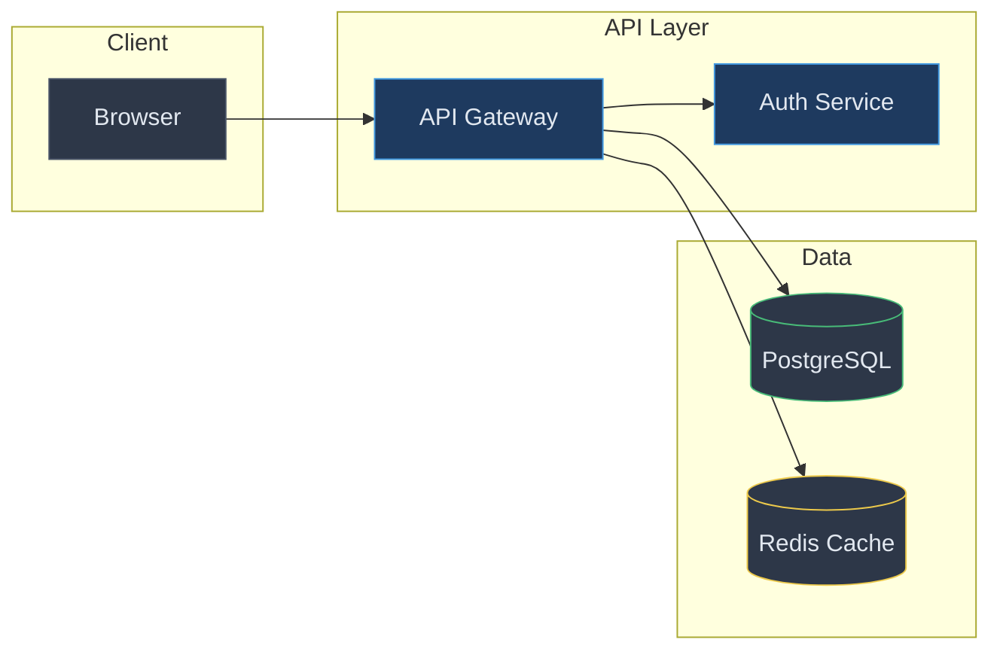

# Visualizing with Mermaid

Creates professional Mermaid diagrams with semantic styling and visual hierarchy. Use when creating flowcharts, sequence diagrams, state machines, class diagrams, or architecture visualizations.

**Default: Dark mode colors.**

## Choosing Diagram Type

| Concept | Diagram Type |
|---------|--------------|
| Process flows, decisions | Flowchart (TB direction) |
| API calls, message passing | Sequence diagram |
| Lifecycle states | State diagram |
| Data models, relationships | Class diagram or ERD |
| System architecture | Flowchart with subgraphs (LR direction) |

## Core Principles

1. **Visual hierarchy over decoration** - Color/size guide the eye to what matters
2. **Semantic color** - Colors have meaning (grouping, state, criticality)
3. **Simplicity over completeness** - 80% clearly beats 100% confusingly
4. **7-12 nodes max** - Human working memory limit

## Quick Styling Guide

**Do:**
- Use fills to group related components
- Highlight critical paths with stroke width
- Different shapes = different component types
- Keep labels to 1-4 words

**Don't:**
- Pure black (`#000000`) - too harsh
- Saturated background colors
- More than 5 colors per diagram
- Low-contrast combinations

## Shape Semantics

- **Rectangles**: Services, processes
- **Rounded rectangles**: APIs, interfaces
- **Circles**: Start/end points, external systems
- **Diamonds**: Decision points
- **Cylinders**: Databases
- **Hexagons**: Queues, message brokers

## Layout

**LR (left-to-right)**: Pipelines, architecture diagrams
**TB (top-to-bottom)**: Hierarchies, decision flows

Use **subgraphs** for: deployment boundaries, logical layers, team ownership.

## Dark Mode Color Palette

```
Background:  #1a1a2e, #16213e, #0f3460
Nodes:       #2d3748, #4a5568, #1e3a5f
Accents:     #e94560 (critical), #48bb78 (success), #4299e1 (info), #ecc94b (warning)
Text:        #e2e8f0 (primary), #a0aec0 (secondary)
Borders:     #4a5568, #2d3748
```

## Light Mode Color Palette

```
Background:  #ffffff, #f7fafc, #edf2f7
Nodes:       #e2e8f0, #cbd5e0, #ebf4ff
Accents:     #e53e3e (critical), #38a169 (success), #3182ce (info), #d69e2e (warning)
Text:        #1a202c (primary), #4a5568 (secondary)
Borders:     #cbd5e0, #e2e8f0
```

## Example: Architecture Diagram



## Workflow

1. **Purpose** - What decision/understanding should this enable?
2. **Type** - Choose based on what you're showing
3. **Structure** - Identify components, relationships, groupings
4. **Style** - Apply semantic colors, highlight critical paths
5. **Review** - Can someone understand it in 10 seconds?
